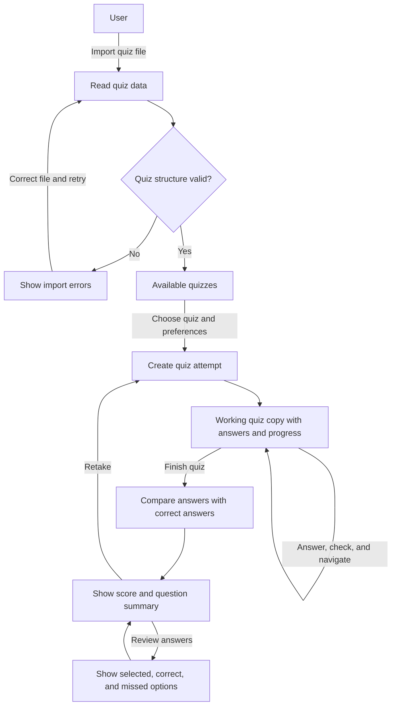
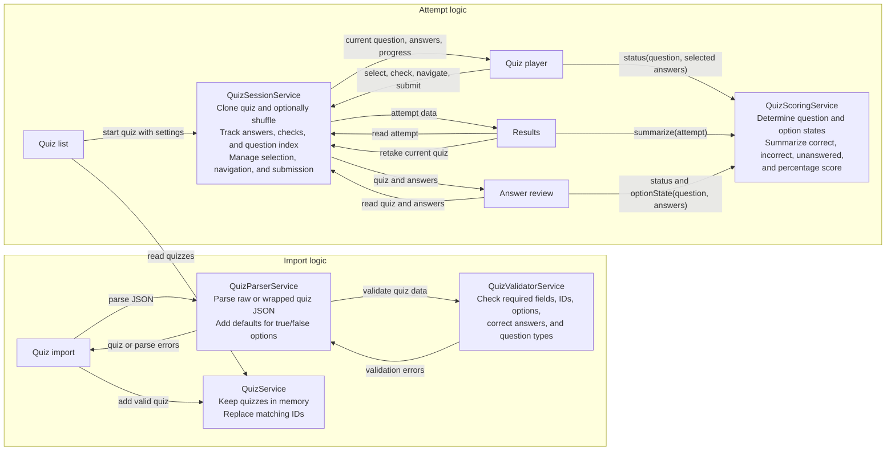

# Project Flow

## Service Logic and Communication

Screens call the services; arrows between services show actual calls or data passed.

## State and Data

- Imported quizzes are kept in memory and are not persisted.
- Each attempt uses a working copy, so shuffling questions or answers does not alter the imported quiz.
- An attempt tracks preferences, selected answers, checked questions, and current progress.
- The score and question summary are calculated from the submitted answers.
